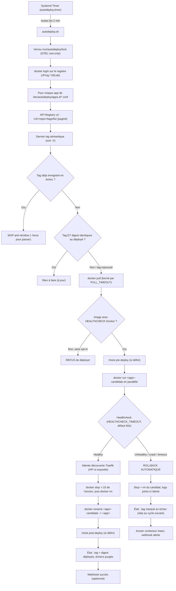

# Docker Autodeploy : POC de Rolling Update Zéro-Downtime avec Traefik & Systemd

Ce projet est un prototype d'automatisation de mise en production continue (Continuous Deployment) pour des environnements Docker standalone, basé sur **GitLab CI**, **Docker Registry**, **Traefik** et **Systemd**.

Il remplace les interventions manuelles en automatisant la surveillance des tags d'images Docker, le déploiement progressif sans coupure de service et le rollback automatique en cas de défaillance.

---

## 📑 Sommaire

Numérotation alignée sur les sections réelles du document (une seule fois chacune).

1. [Principe de fonctionnement](#1-principe-de-fonctionnement)
2. [Pourquoi cette architecture garantit le Zéro-Downtime](#2-pourquoi-cette-architecture-garantit-le-zéro-downtime)
3. [Structure du projet](#3-structure-du-projet)
4. [Environnement de Test Local (OpenTofu / Terraform + Sample App)](#4-environnement-de-test-local-opentofu--terraform--sample-app)
5. [Prérequis](#5-prérequis)
6. [Guide d'installation](#6-guide-dinstallation)
7. [Configuration détaillée](#7-configuration-détaillée)
8. [Tester le POC localement (Simulation interactive)](#8-tester-le-poc-localement-simulation-interactive)
9. [Exploitation & Commandes usuelles](#9-exploitation--commandes-usuelles)
10. [Gestion des erreurs et Rollback](#10-gestion-des-erreurs-et-rollback)
11. [Documentation complémentaire](#11-documentation-complémentaire)

---

## 1. Principe de fonctionnement


Le déploiement fonctionne selon une boucle périodique cadencée par **Systemd Timer** (toutes les 2 minutes par défaut) :



---

## 2. Pourquoi cette architecture garantit le Zéro-Downtime

Avec Docker classique sans orchestrateur (ni Swarm ni Kubernetes), deux conteneurs ne peuvent pas écouter sur le même port de la machine hôte (`-p 80:80`).

**La solution avec Traefik :**
1. Les conteneurs ne publient **aucun port sur l'hôte**. Ils communiquent uniquement via un réseau Docker interne partagé avec Traefik (`traefik-net`).
2. Le nouveau conteneur candidat (`myapp-candidate`) démarre avec **les mêmes labels Traefik** que le conteneur en production (`traefik.http.routers.myapp...` et `traefik.http.services.myapp...`).
3. **Attention — mythe courant :** le provider Docker de Traefik **ne lit PAS** le `HEALTHCHECK` Docker (`.State.Health`). Il découvre le conteneur et le route **dès qu'il voit les labels**, qu'il soit prêt ou non. Le `HEALTHCHECK` Docker sert au **script** (validation du candidat avant bascule), pas à Traefik.
4. **Le seul vrai garde-fou est le healthcheck côté Traefik** (`traefik.http.services.myapp.loadbalancer.healthcheck.*`). Avec ces labels, Traefik sonde le candidat lui-même et ne le fait entrer dans le pool que quand **son** healthcheck passe ; un candidat qui traîne ou casse est évincé automatiquement. **Sans ces labels, la bascule est une loterie.**
5. Lorsque l'ancien conteneur est stoppé (`docker stop`), Traefik le retire de ses routes **dès qu'il reçoit l'événement Docker** (quasi-instantané, mais pas magique : d'où l'attente active sur l'API Traefik dans le script quand elle est exposée).
6. Résultat : **zéro paquet perdu**, transition fluide — **à condition** que le healthcheck Traefik soit configuré (point 4).

### Les trois règles dures (vérifiées empiriquement, pas théoriques)

Ces trois règles ont été observées sur Traefik v3.0 en montante, pas déduites de la doc. Les enfreindre ne dégrade pas le comportement : **ça coupe le trafic**.

**Règle 1 — les labels du SERVICE doivent être strictement identiques entre l'ancien et le candidat.**
Si deux conteneurs déclarent le même service avec des labels différents (typiquement : le candidat a `loadbalancer.healthcheck.*` et pas l'ancien), Traefik ne fusionne pas les deux. Il **supprime le service** et loggue :

```
ERR Service defined multiple times with different configurations  serviceName=myapp
ERR the service "myapp@docker" does not exist                     routerName=myapp@docker
```

Le router passe `status: disabled` et **tout le trafic répond 404** pendant toute la phase parallèle — pas seulement sur le candidat. Corollaire important pour l'exploitation : **faire évoluer les labels d'un service est une migration coordonnée**, pas un simple redéploiement. Le conteneur en place porte les anciens labels ; il faut d'abord le redéployer avec les nouveaux (ou planifier une fenêtre), sinon le premier rolling après le changement casse la prod.

**Règle 2 — le middleware `retry` est nécessaire mais il ne résout PAS la fenêtre d'arrêt.**

```bash
--label "traefik.http.middlewares.myapp_retry.retry.attempts=2"
--label "traefik.http.routers.myapp.middlewares=myapp_retry"
```

Il faut le mettre : il absorbe les erreurs de connexion franches vers un backend absent. Mais il **ne supprime pas** la fenêtre résiduelle du swap, et peut même l'aggraver.

Mesures, pinger à 50ms, `retry.attempts=2`, swap `docker stop` → `rm` → `rename` :

| Configuration | Runs en échec | Requêtes | Erreurs |
|---|---|---|---|
| nginx (images de démo), swap direct | 3 / 5 | 120 | 3 |
| `sample-app` (drain SIGTERM 1,5s côté app), swap direct | **5 / 5** | ~155 | 5 |
| swap **avec drain moteur** (attente éviction Traefik) | **0 / 5** | 246 | 0 |

L'erreur résiduelle n'est pas un refus de connexion mais un **timeout** : `Operation timed out after 2001 ms with 0 bytes received`. La requête reste accrochée à une connexion keep-alive déjà établie vers le backend en cours d'arrêt ; le backend ne refuse pas, il ne répond pas. Traefik attend, `attempts=2` fait attendre deux fois, le client décroche avant.

**Point important : le drain côté application ne suffit pas.** `env/sample-app/server.js` reste volontairement *acceptant* 1,5s après SIGTERM pour ne pas envoyer de 502 pendant que Traefik route encore. Mesuré : ça ne ferme pas la fenêtre — ça la rend **déterministe** (échec systématiquement sur la même requête, la requête qui tombe à l'instant où le listener se ferme pendant que Traefik route encore).

**Le seul remède mesuré efficace est le drain côté moteur** : faire échouer le healthcheck de l'ancien conteneur, **attendre que Traefik le marque `DOWN`** (vérifiable via `/api/http/services/<svc>`), puis seulement `docker stop`. Avec `healthcheck.interval=1s`, l'éviction est effective en ~2s, et le swap passe à 0 erreur sur 246 requêtes.

**Ce que fait le moteur aujourd'hui : il ne draine pas.** La fenêtre est donc réelle en production — environ 3 % des requêtes émises pendant le swap, et reproductible à chaque cycle avec une app qui draine côté process. C'est le prochain maillon à construire : une attente d'éviction dans `autodeploy.sh` avant le `docker stop`, pas une modification des images.

Caveat du retry, à pondérer par service : il rejoue la requête sur l'autre serveur. Sans danger pour les méthodes idempotentes (GET), potentiellement doubleur d'effet de bord sur un POST non idempotent.

**Règle 3 — un label invalide fait tomber TOUT le service, pas seulement ce label.**
Le chemin `loadbalancer.retry.*` (valide en Traefik v2) provoque en v3 `field not found, node: retry` et le service disparaît entièrement → 404 général. Même cause, même effet que la règle 1. D'où l'intérêt de vérifier le rendu réel dans l'API Traefik (`/api/http/services`, `/api/http/routers`) plutôt que de supposer que les labels sont acceptés.

**Règle 4 — un Traefik qui monte le socket Docker voit TOUS les conteneurs labelisés de la machine.**
Ce n'est pas un détail de dev, c'est le fonctionnement du provider. Deux stacks distinctes sur le même hôte se retrouvent donc dans le **même** fichier de configuration, et si leurs routers ont une règle de même longueur (`PathPrefix(\`/\`)` partout, cas le plus courant), le départage est arbitraire. Un router étranger peut gagner ; si son backend est injoignable depuis le réseau de l'autre stack, le trafic renvoie `503 no available server` **sans que la moindre chose soit cassée chez soi**.

Ce piège a été observé concrètement : la démo `demo/` passait seule, puis échouait systématiquement après un run de `env/test-full-scenario.sh` — l'infrastructure de test étant laissée active par conception, son `sample-app@docker` entrait en collision avec `demo-app@docker`.

Correctifs appliqués à la démo : `traefik.http.routers.demo-app.priority=1000` (victoire déterministe sur les routers par défaut à 15). À noter : le filtrage par réseau (`--providers.docker.network`) **ne filtre pas** ce que le provider observe — il ne choisit que l'IP à utiliser — et les options `--providers.docker.filters` / `.label` n'existent pas en v3.0. Les deux seules défenses disponibles sont donc **la priorité explicite** ou **une règle `Host()` distincte**.

Corollaire d'exploitation : ne faites pas tourner deux stacks labelisées simultanément en comptant sur l'isolation, elle n'existe pas au niveau du provider.

---

## 3. Structure du projet

```
.
├── bin/
│   └── autodeploy.sh               # Moteur bash principal (rolling deploy + healthcheck + rollback)
├── config/
│   ├── autodeploy.env.example      # Template de variables globales (GitLab, tokens)
│   └── apps.d/
│       └── example-app.conf.example # Modèle de configuration par conteneur
├── systemd/
│   ├── autodeploy.service          # Définition de l'unité Systemd
│   └── autodeploy.timer            # Définition du timer périodique
├── env/                            # Environnement de test local complet
│   ├── terraform/                  # Code IaC OpenTofu / Terraform (Registry v2 + Traefik v3)
│   │   ├── main.tf
│   │   ├── variables.tf
│   │   ├── versions.tf
│   │   └── outputs.tf
│   ├── sample-app/                 # Application de démonstration avec Healthcheck
│   │   ├── server.js
│   │   ├── Dockerfile
│   │   └── build-and-push.sh       # Script de build et push (versions saines et cassées)
│   ├── test-full-scenario.sh       # Scénario de test automatisé end-to-end
│   └── README.md
├── demo/
│   └── test-local-simulation.sh    # Simulation autonome sans IaC
├── install.sh                      # Script d'installation automatique
├── uninstall.sh                    # Script de désinstallation propre
└── README.md
```

---

## 4. Environnement de Test Local (OpenTofu / Terraform + Sample App)

Pour tester le flux complet de bout en bout sur votre machine avec **OpenTofu** ou **Terraform** :

```bash
# Lancement du scénario complet automatisé
./env/test-full-scenario.sh
```

Ce scénario automatique va :
1. Déployer avec `tofu` (ou `terraform`) un Docker Registry local (`localhost:5001`) et Traefik (`localhost:9080`, dashboard `9081`).
2. Construire et publier l'image `sample-app:1.0.0` sur le registre local.
3. Déclencher `autodeploy.sh` pour déployer la v1.0.0.
4. Construire et publier la mise à jour `sample-app:1.1.0`.
5. Exécuter un trafic HTTP continu et déclencher le rolling update sans aucune interruption (0 downtime).
6. Construire et publier une version `sample-app:1.2.0` avec un endpoint `/health` défaillant (erreur 500).
7. Valider que le script déclenche le **Rollback automatique**, détruit le candidat défaillant et maintient la version stable en production.

### ⚠️ Prérequis Docker (rootless, registre HTTP, version Traefik)

Ces trois points font échouer le scénario sur une machine récente s'ils ne sont
pas réunis. Le socket est **auto-détecté** et Traefik **épinglé en v3.6**, mais le
registre HTTP local demande une configuration du démon.

**1. Socket Docker (rootless vs rootful).** Le script et Terraform montent le
socket que le démon écoute réellement, détecté dans cet ordre : `DOCKER_HOST`
(`unix://…`) → `$XDG_RUNTIME_DIR/docker.sock` (rootless) → `/var/run/docker.sock`
(rootful). Sur un Docker **rootless**, `/var/run/docker.sock` n'existe pas pour le
conteneur : y pointer donne `permission denied`. C'est auto-détecté, rien à faire.
En `terraform apply` **direct** (hors script), passez la valeur à la main :
`TF_VAR_docker_socket=/run/user/$(id -u)/docker.sock`.

**2. Registre HTTP local (`insecure-registries`).** Le scénario pousse sur
`localhost:5001` en **HTTP** (`registry:2` sans TLS). Docker refuse par défaut et
bascule en HTTPS (`https://localhost:5001 … connection refused`). Il faut
déclarer le registre en `insecure-registries` puis **redémarrer le démon** :

```bash
# rootful : /etc/docker/daemon.json (sudo)   |   rootless : ~/.config/docker/daemon.json
{ "insecure-registries": ["localhost:5001", "127.0.0.1:5001"] }

# rootful : sudo systemctl restart docker
# rootless : systemctl --user restart docker
```

Sans ça, le `docker push` de l'étape 2 échoue et le scénario s'arrête.

**3. Version de Traefik.** Le scénario utilise **`traefik:v3.6`** (variable
`traefik_image`). **Ne pas remettre `v3.0`** avec Docker ≥ 28 : son client Docker
négocie l'API `1.24`, refusée par le démon (`Minimum supported API version is
1.40`), le provider ne se charge pas et **tout répond 404**. Les règles de labels
du §2 (retry en middleware, healthcheck de service, `priority`) sont identiques en
v3.6.

---

## 5. Prérequis

Sur le serveur de production (Debian, Ubuntu, RHEL, Rocky Linux, etc.) :

1. **Docker Engine** installé et fonctionnel.
2. **Outils système requis** : `curl`, `jq`, `sort`, `grep` (présents par défaut ou via `apt install curl jq`).
3. **Un compte robot JFrog Artifactory** (la voie de prod, cf. [PASSAGE_EN_PROD §Action 1](docs/PASSAGE_EN_PROD.md)) :
   * Compte de service dédié (ex: `svc-autodeploy`) avec le rôle **Read** sur le repo Docker.
   * **API Key** ou **Identity Token** généré pour ce compte.
   * Le script interroge directement l'API Registry v2 de JFrog (`/v2/<repo>/tags/list`) en Basic auth.
   * L'ancien mode « Deploy Token GitLab » (`GITLAB_PROJECT_ID`) est un **fallback legacy** — à ne plus utiliser.

---

## 6. Guide d'installation

### Étape 1 : Cloner le dépôt et lancer l'installateur
Sur le serveur hôte :
```bash
git clone <url_de_votre_repo> autodeploy
cd autodeploy
sudo ./install.sh
```

L'installateur :
* Installe `/usr/local/bin/autodeploy.sh` (permissions 755).
* Crée `/etc/autodeploy/` et `/etc/autodeploy/apps.d/`.
* Copie le template d'environnement dans `/etc/autodeploy/autodeploy.env` (permissions 600).
* Installe et démarre le timer Systemd.

---

## 7. Configuration détaillée


### 1. Variables globales : `/etc/autodeploy/autodeploy.env`

Éditez le fichier `/etc/autodeploy/autodeploy.env` :
```bash
# Nom d'hôte du registre Docker (JFrog Artifactory — la voie de prod)
REGISTRY_HOST="jfrog.mon-entreprise.fr"

# Compte robot JFrog dédié (cf. PASSAGE_EN_PROD §Action 1)
REGISTRY_USER="svc-autodeploy"

# API Key ou Identity Token JFrog
REGISTRY_TOKEN="AKCp8xxxxxxxxxxxxxxxxxxxxxxxxxxxxxxxxxxxx"

# [LEGACY] Ne renseigner GITLAB_URL / GITLAB_TOKEN que si vous utilisez
# l'ancien mode API tags GitLab (fallback). Laisser vide en contexte JFrog.
GITLAB_URL=""
GITLAB_TOKEN=""

# Optionnel : Webhook pour recevoir les alertes sur Slack/Discord/Teams
WEBHOOK_URL="https://discord.com/api/webhooks/xxx/yyy"

# Nettoyage automatique des images orphelines (évite de saturer le disque)
AUTO_PRUNE_IMAGES="true"
```

### 2. Déclaration d'une application : `/etc/autodeploy/apps.d/<nom>.conf`

Pour chaque conteneur à surveiller, créez un fichier `.conf` distinct dans `/etc/autodeploy/apps.d/` (ex: `/etc/autodeploy/apps.d/mon-api.conf`) :

```bash
# Nom du conteneur en production
APP_NAME="mon-api"

# URL de l'image (sans le tag)
IMAGE_REPO="registry.gitlab.mon-entreprise.com/pole-tech/mon-api"

# [LEGACY] ID du projet GitLab — fallback uniquement. En contexte JFrog,
# laisser vide : le script interroge l'API Registry v2 du registre.
GITLAB_PROJECT_ID=""

# Réseau Docker partagé avec Traefik
DOCKER_NETWORK="traefik-net"

# Timeout de validation de démarrage (secondes)
HEALTHCHECK_TIMEOUT=45

# Paramètres du 'docker run'
# NOTE : N'incluez ni le nom (--name) ni l'image, le script s'en charge.
DOCKER_RUN_ARGS=(
  --restart unless-stopped
  --network "$DOCKER_NETWORK"
  
  # Variables d'environnement applicatives
  -e "NODE_ENV=production"
  -e "PORT=3000"

  # Labels Traefik pour le routage dynamique
  --label "traefik.enable=true"
  --label "traefik.http.routers.mon-api.rule=Host(\`api.mon-entreprise.com\`)"
  --label "traefik.http.routers.mon-api.entrypoints=websecure"
  --label "traefik.http.routers.mon-api.tls=true"
  --label "traefik.http.services.mon-api.loadbalancer.server.port=3000"

  # Healthcheck TRAEFIK (le vrai garde-fou du zéro-downtime — voir §2)
  # ATTENTION (règle 1, §2) : ces labels doivent être IDENTIQUES sur l'ancien et le
  # candidat, sinon Traefik supprime le service et tout le trafic tombe en 404.
  --label "traefik.http.services.mon-api.loadbalancer.healthcheck.path=/health"
  --label "traefik.http.services.mon-api.loadbalancer.healthcheck.interval=3s"
  --label "traefik.http.services.mon-api.loadbalancer.healthcheck.timeout=2s"

  # Middleware RETRY (règle 2, §2) : absorbe la fenêtre entre l'arrêt de l'ancien
  # et son retrait du pool. En Traefik v3 c'est un middleware, PAS un champ du
  # load balancer (`loadbalancer.retry.*` = "field not found" => service supprimé).
  --label "traefik.http.middlewares.mon_api_retry.retry.attempts=2"
  --label "traefik.http.routers.mon-api.middlewares=mon_api_retry"

  # Healthcheck Docker (indispensable pour que le script sache si l'app est prête).
  # wget et non curl : node:alpine, nginx:alpine, jdk:alpine n'ont pas curl.
  --health-cmd "wget -q -O - http://localhost:3000/health >/dev/null || exit 1"
  --health-interval 3s
  --health-timeout 2s
  --health-retries 3
  --health-start-period 5s
)

# Budgets et garde-fous optionnels (valeurs par défaut affichées)
# PULL_TIMEOUT=300              # max du docker pull (registre suspendu)
# ALLOW_NO_HEALTHCHECK=false    # true = accepte une image sans HEALTHCHECK (déconseillé)
# NO_HEALTHCHECK_STABLE_SECONDS=6
```

### 3. Hooks `PRE_DEPLOY_CMD` / `POST_DEPLOY_CMD`

Les hooks sont exécutés par un wrapper (`run_hook`) qui loggue le hook **par son nom**, capture son code de sortie et pousse un webhook identifiant le hook fautif.

| Hook | Moment | Effet d'un échec |
|---|---|---|
| `PRE_DEPLOY_CMD` | Après le pull, **avant** tout changement d'état | Déploiement de l'app annulé, ancien conteneur intact. |
| `POST_DEPLOY_CMD` | **Après** la bascule | Bascule **conservée** (elle est déjà effective), cycle en erreur. À traiter à la main. |

**Variables exposées** (exportées, donc visibles aussi par les sous-processus du hook) :

| Variable | Contenu |
|---|---|
| `HOOK_PHASE` | `pre-deploy` ou `post-deploy` |
| `APP_NAME` | nom logique de l'app (`mon-api`) |
| `IMAGE_REPO` | dépôt d'image sans tag |
| `LATEST_TAG` | tag sémantique résolu (`1.4.2`) |
| `TARGET_IMAGE` | `repo:tag` déployé |
| `CURRENT_CONTAINER` | nom du conteneur en prod |
| `NEXT_CONTAINER` | nom du conteneur candidat |
| `CONF_FILE` | chemin du `.conf` source |

**Le hook tourne dans un sous-shell.** C'est un choix, pas un détail : dans un `eval` à plat, un `exit N` du hook — réflexe normal de tout script shell qui rencontre une erreur — remontait et **tuait le moteur entier**, emportant la persistance de l'état, le webhook et le nettoyage. En sous-shell, `exit 3` dans un hook signifie « ce hook échoue de 3 » et le cycle continue pour les autres apps.

Corollaire assumé : un hook **ne peut pas** modifier l'état interne du moteur. Il reçoit les variables ci-dessus, il n'en renvoie aucune. Un hook qui doit transmettre quelque chose le fait par un canal externe (API, fichier, webhook).

---

## 8. Tester le POC localement (Simulation interactive)

Un script de démo est fourni dans `demo/test-local-simulation.sh`. Il ne nécessite aucun GitLab externe et permet de valider le comportement en conditions réelles sur votre poste avec Docker.

Ce script :
1. Démarre une instance locale de **Traefik**.
2. Construit localement 3 images de test :
   * `v1.0.0` (production initiale)
   * `v1.1.0` (mise à jour)
   * `v1.2.0` (version défaillante avec un `/health` cassé)
3. Lance un bombardement de requêtes HTTP en tâche de fond.
4. Effectue le rolling update vers `v1.1.0` et **prouve qu'aucune requête n'échoue** (zéro downtime).
5. Tente de déployer la version `v1.2.0` cassée : **déclenche le rollback automatique** et prouve que la `v1.1.0` est restée active sans interruption.

Pour exécuter la démo :
```bash
./demo/test-local-simulation.sh
```

---

## 9. Exploitation & Commandes usuelles

### Suivre l'activité en temps réel
Pour consulter les logs du service :
```bash
journalctl -u autodeploy.service -f
```

### Vérifier le prochain passage du Timer
```bash
systemctl list-timers autodeploy.timer
```

### Forcer un déploiement immédiat (sans attendre le timer)
```bash
sudo systemctl start autodeploy.service
```

### Exécuter le script manuellement pour déboguer
```bash
sudo /usr/local/bin/autodeploy.sh
```

---

## 10. Gestion des erreurs et Rollback

| Scénario d'erreur | Action prise par le script | Impact en production |
|---|---|---|
| **Réseau / Registre indisponible** | `docker pull` échoue, app skippée, webhook alerte. | **Aucun** (l'ancien conteneur continue). |
| **Pull suspendu (socket ouvert, aucun octet)** | Tué à `PULL_TIMEOUT` (300s défaut), app skippée. | **Aucun**. Le cycle continue pour les autres apps. |
| **Auth registre refusée (401/403), repo 404** | Erreur explicite + webhook, app skippée. Jamais confondu avec « aucun tag ». | **Aucun**. |
| **Image sans `HEALTHCHECK` Docker** | **Déploiement refusé** par défaut (`ALLOW_NO_HEALTHCHECK=true` pour assumer). | **Aucun**. |
| **Crash au démarrage du candidat** | Statut `exited`/`dead` détecté, candidat détruit, tag marqué en échec. | **Aucun**. |
| **Healthcheck KO (timeout)** | Rollback, 30 lignes de log du candidat jointes à l'alerte. | **Aucun**. |
| **Même tag, contenu repoussé** | Digest différent détecté → redéploiement effectif. | Rollable normalement. |
| **Tag déjà en échec, re-cycle** | SKIP anti-récidive (pas de pull/run). `--force <app>` pour repasser. | **Aucun** (pas de boucle d'alertes). |
| **Deux timers se chevauchent** | Verrou `flock` sur `/run/autodeploy/lock` (0700). La 2ᵉ instance sort proprement. | **Aucun** (pas de concurrence). |
| **Hook `pre-deploy` en échec** | Déploiement annulé AVANT tout changement d'état ; le hook fautif est nommé dans l'alerte. | **Aucun**. |
| **Hook `post-deploy` en échec** | Bascule **conservée** (elle est déjà effective), cycle en erreur, hook nommé. | Rollback non déclenché — à traiter manuellement. |
| **Disque saturé d'images** | `docker image prune -f` en fin de cycle (`AUTO_PRUNE_IMAGES`). | Versions obsolètes nettoyées. |

### Commandes d'exploitation de l'état

```bash
autodeploy.sh --status              # table : app / version locale / distante / échecs
autodeploy.sh --reset-failed mon-api  # purge l'état d'échec (nouvelle chance)
autodeploy.sh --force mon-api         # redéploie malgré le tag en échec
```

---

## 11. Documentation complémentaire

* [Workflow testé E2E (détails complets)](docs/WORKFLOW_E2E.md)
* [Guide de passage en production (checklist & prérequis)](docs/PASSAGE_EN_PROD.md)
